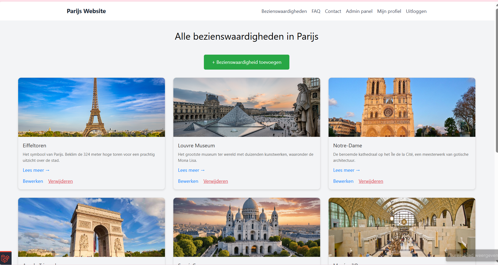
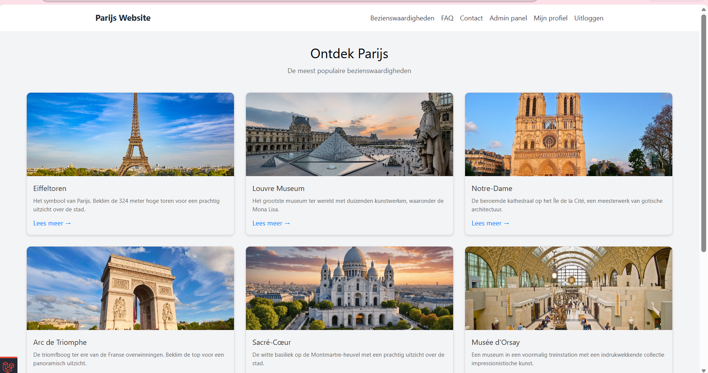
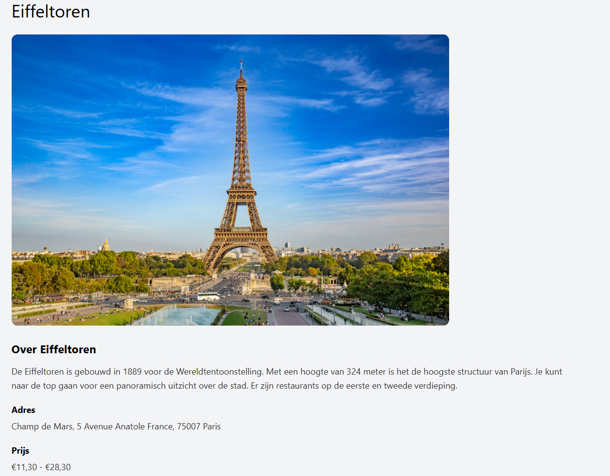

<p align="center" style="font-size: 24px; margin-bottom: -25px; color: #EF3B2D;">
    <strong>Educational<br/> Starter Pack<br/></strong><span style="color:gray">for</span>
</p>
<p align="center"><a href="https://laravel.com" target="_blank"></a></p>

<p align="center">
<a href="https://github.com/laravel/framework/actions"></a>
<a href="https://packagist.org/packages/laravel/framework"></a>
<a href="https://packagist.org/packages/laravel/framework"></a>
<a href="https://packagist.org/packages/laravel/framework"></a>
</p>


---

## About this Starter Pack
<div style="background-color: #f6f8fa; padding: 10px; border-radius: 5px;">
This is a starter pack for <strong>Laravel tailored for educational purposes</strong>. 

It is aimed at helping students and beginners to quickly set up a Laravel development environment that allows for 
learning the basics without the need to configure everything from scratch.
</div>

### Changes from the original Laravel repository
It provides a pre-configured environment with some opinionated settings and packages for the educational context. 
Initial customisation was done based on Laravel version 12.x. (12.37.0 on November 9th, 2025).
Updated to Laravel 13.x (13.7 on May 4th, 2026), including now also Laravel Boost.

- Added **barryvdh/laravel-debugbar** for debug info in the browser
- Altered **.env.example** for local development (SQLite database, debug mode on, cache and session set to file)
- Added **roave/security-advisories** to prevent installation of packages with known security issues
- Added **laravel/boost** for AI assisted code generation
- Used **laravel/breeze** for authentication scaffolding with Blade templates (but moved all of the component views to a `components.breeze` subfolder for better organization)
- Replaced vite and related front-end dependencies by **CDN includes of Tailwind CSS and Alpine JS** to keep things simple
- Replaced PHP Unit by **Pest PHP** for testing, kept basic example tests
- Some other small tweaks in configuration files, routes, controller, and view organisation to better reflect the educational purpose (rigid structure)

Everything that follows below (and the shields in the header) are part of the original Laravel README.md file.

---
## About Laravel

Laravel is a web application framework with expressive, elegant syntax. We believe development must be an enjoyable and creative experience to be truly fulfilling. Laravel takes the pain out of development by easing common tasks used in many web projects, such as:

- [Simple, fast routing engine](https://laravel.com/docs/routing).
- [Powerful dependency injection container](https://laravel.com/docs/container).
- Multiple back-ends for [session](https://laravel.com/docs/session) and [cache](https://laravel.com/docs/cache) storage.
- Expressive, intuitive [database ORM](https://laravel.com/docs/eloquent).
- Database agnostic [schema migrations](https://laravel.com/docs/migrations).
- [Robust background job processing](https://laravel.com/docs/queues).
- [Real-time event broadcasting](https://laravel.com/docs/broadcasting).

Laravel is accessible, powerful, and provides tools required for large, robust applications.

## Learning Laravel

Laravel has the most extensive and thorough [documentation](https://laravel.com/docs) and video tutorial library of all modern web application frameworks, making it a breeze to get started with the framework.

In addition, [Laracasts](https://laracasts.com) contains thousands of video tutorials on a range of topics including Laravel, modern PHP, unit testing, and JavaScript. Boost your skills by digging into our comprehensive video library.

You can also watch bite-sized lessons with real-world projects on [Laravel Learn](https://laravel.com/learn), where you will be guided through building a Laravel application from scratch while learning PHP fundamentals.

## Agentic Development

Laravel's predictable structure and conventions make it ideal for AI coding agents like Claude Code, Cursor, and GitHub Copilot. Install [Laravel Boost](https://laravel.com/docs/ai) to supercharge your AI workflow:

```bash
composer require laravel/boost --dev

php artisan boost:install
```

Boost provides your agent 15+ tools and skills that help agents build Laravel applications while following best practices.

## Contributing

Thank you for considering contributing to the Laravel framework! The contribution guide can be found in the [Laravel documentation](https://laravel.com/docs/contributions).

## Code of Conduct

In order to ensure that the Laravel community is welcoming to all, please review and abide by the [Code of Conduct](https://laravel.com/docs/contributions#code-of-conduct).

## Security Vulnerabilities

If you discover a security vulnerability within Laravel, please send an e-mail to Taylor Otwell via [taylor@laravel.com](mailto:taylor@laravel.com). All security vulnerabilities will be promptly addressed.

## License

The Laravel framework is open-sourced software licensed under the [MIT license](https://opensource.org/licenses/MIT).

Project: Toeristische website over Parijs
1. Inleiding
Dit project is gemaakt voor het vak Backend Web. Het is een website over Parijs voor toeristen. Bezoekers kunnen informatie vinden over bezienswaardigheden, veelgestelde vragen bekijken en een contactformulier invullen. Als admin kan ik alles beheren: bezienswaardigheden, FAQ, gebruikers en meer.

De website is gebouwd met Laravel 13 en volgt de MVC-structuur zoals in de les behandeld.

2. Hoe ik het project heb aangepakt
Stap 1: Project opzetten
Ik begon met het aanmaken van een nieuw Laravel-project via Herd met de starterpack van de docent. Daarna heb ik SQLite ingesteld als database omdat dat in de les werd aangeraden voor lokale ontwikkeling. Ik paste het .env bestand aan en voerde de migraties uit.

Stap 2: Authenticatie en admin account
Ik installeerde Breeze voor het login en registratie systeem. Daarna maakte ik een admin account aan via een seeder met de gegevens die de docent vroeg: admin@ehb.be en Password!321. Ik voegde ook een is_admin veld toe aan de users tabel zodat ik later kon controleren wie admin is.

Stap 3: Profielpagina
Ik maakte een ProfileController en voegde velden toe aan de users tabel: username, birthday, profile_picture en about_me. Ik maakte routes voor het bekijken, bewerken en bijwerken van profielen. De views maakte ik zodat gebruikers hun eigen profiel kunnen zien en aanpassen. Voor foto upload gebruikte ik de storage link zoals in de les.

Stap 4: Bezienswaardigheden beheren
Ik maakte een Attraction model en migratie voor de bezienswaardigheden tabel. Daarna maakte ik een AttractionController met alle CRUD functionaliteiten: index, show, create, store, edit, update en destroy. Alleen de admin kan bezienswaardigheden toevoegen, bewerken of verwijderen. Ik maakte ook een seeder met 7 bezienswaardigheden als testdata.

Stap 5: Admin rechten
Ik maakte een AdminController voor het beheren van gebruikers. Ik maakte een pagina waar de admin alle gebruikers kan zien en anderen admin kan maken of admin rechten kan afnemen. De hoofdadmin kan zichzelf geen rechten afnemen.

Stap 6: FAQ pagina
Ik maakte twee modellen: Category en Faq. Een category heeft meerdere faqs. Ik maakte seeders met testdata en een FaqController met een index methode. De view toont alle categorieën met bijbehorende vragen en antwoorden.

Stap 7: Contact pagina
Ik maakte een ContactController met een show en send methode. Het formulier heeft validatie voor naam, email en bericht. Bij verzending krijgt de admin een email met de inhoud. Ik gebruikte Mail::to voor het versturen.

Stap 8: Layout en navigatie
Ik paste de layout aan met een navigatiebalk met links naar alle paginas: Home, Bezienswaardigheden, FAQ, Contact, Profiel, Admin panel en Uitloggen. Ik gebruikte route() voor alle links zoals in de les.

Stap 9: Styling
Ik voegde eigen CSS toe in de views. Geen frameworks zoals Tailwind omdat de docent zei dat we geen frameworks mochten gebruiken.

Stap 10: Testen
Ik testte alle functionaliteiten: inloggen, registreren, profiel bewerken, bezienswaardigheden toevoegen, bezienswaardigheden bewerken, bezienswaardigheden verwijderen, FAQ bekijken, contact versturen en admin rechten geven.

3. Gebruikte technieken uit de leerstof
Techniek	Module	Waar gebruikt
Blade layouts (extends, section, yield)	4.2	Alle views
Blade directives (foreach, if, auth)	4.1, 5.3	Home, bezienswaardigheden, FAQ
Controllers	6.2	Alle functionaliteiten
Routes met named routes	3.7	Alle links
Models en migraties	7.1, 7.3	Attraction, Category, Faq
Seeders	7.4	Admin, bezienswaardigheden, FAQ
Eloquent ORM	7.5	Database queries
CSRF beveiliging	8.1	Alle formulieren
Validatie	8.2	Contact, profiel, bezienswaardigheden
File uploads	8.5	Profielfoto, bezienswaardigheden afbeeldingen
Auth facade	5.4	Admin checks
Middleware	5.2	Dashboard
4. Hoe installeer je dit project
Clone de repository

Kopieer .env.example naar .env

Pas de database instellingen aan in .env (SQLite of MySQL)

Voer composer install uit

Voer npm install en npm run build uit

Genereer de app key: php artisan key:generate

Voer de migraties uit: php artisan migrate

Voer de seeders uit: php artisan db:seed

Start de server: php artisan serve

Login met admin@ehb.be en Password!321

5. Admin account
Email: admin@ehb.be

Wachtwoord: Password!321

6. Screenshots
Homepagina
De homepagina toont alle bezienswaardigheden met afbeelding, titel en beschrijving. Elke kaart heeft een Lees meer link naar de detailpagina.
home pagina : , homepagina voor bezoekers : 
Detailpagina : 
De detailpagina toont de naam, afbeelding, uitgebreide beschrijving, adres en prijs van de attractie.

Profielpagina
Gebruikers kunnen hun profiel bekijken en bewerken. Ze kunnen een username, verjaardag, profielfoto en over mij tekst toevoegen.

Bezienswaardigheden overzicht
Bezoekers kunnen alle bezienswaardigheden zien. Admin kan bezienswaardigheden toevoegen, bewerken en verwijderen.

FAQ pagina
Alle vragen zijn gegroepeerd per categorie. Bezoekers kunnen alle vragen en antwoorden lezen.

Contact pagina
Bezoekers kunnen een bericht sturen met naam, email en bericht. Admin krijgt een email.

Admin panel
Admin kan alle gebruikers zien en anderen admin maken of admin rechten afnemen.

7. Mijn commits
Ik heb regelmatig commits gedaan tijdens het bouwen van het project. Elke functionaliteit kreeg een aparte commit met een duidelijke beschrijving. Zo kan de docent zien hoe ik stap voor stap heb gewerkt. De code is volledig door mijzelf geschreven op basis van de leerstof. Om mijn bouwritme goed te houden en te zorgen dat ik gestructureerd te werk ging, heb ik DeepSeek gebruikt voor uitleg bij bepaalde concepten en hulp bij foutmeldingen. De code zelf heb ik echter altijd zelf geschreven.

8. Bronnen
Laravel documentatie (laravel.com/docs)

De leerstof van de docent (modules 1 tot 8)

DeepSeek (AI assistent) voor uitleg bij de leerstof en hulp bij foutmeldingen tijdens het programmeren. Ik heb DeepSeek gebruikt wanneer ik een concept niet goed snapte of een foutmelding kreeg die ik niet kon oplossen. De code is volledig door mijzelf geschreven op basis van de leerstof.

Afbeeldingen van bezienswaardigheden zijn eigen foto's

9. Wat ik geleerd heb
Tijdens dit project heb ik geleerd hoe Laravel werkt in de praktijk. Ik begrijp nu beter hoe MVC werkt, hoe je routes maakt, hoe je controllers gebruikt en hoe je met Eloquent modellen werkt. Ook heb ik geleerd hoe je authenticatie en admin rechten opzet. Het moeilijkste vond ik de relaties tussen modellen en het werken met seeders.

